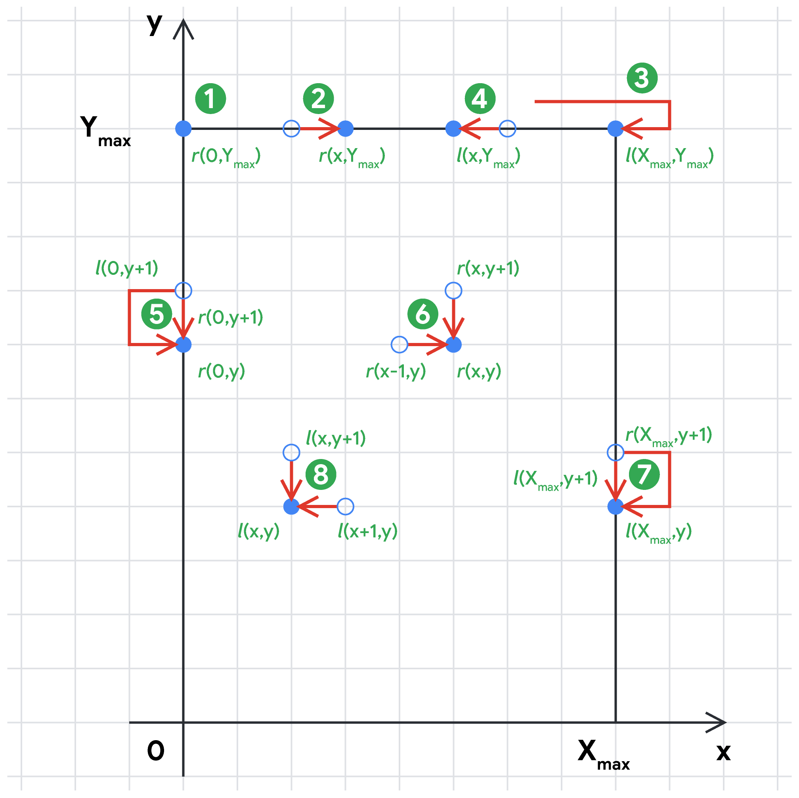

# Problem D - Cute Little Butterfly

## Analysis

This document is a backup. ([ref](https://codingcompetitions.withgoogle.com/kickstart/round/00000000008cb2e1/0000000000c17b68))

### Test Set 1 (11pts)

Let us introduce some notation first.

  + The maximum $x$-coordinate of a flower $X_{max}=\max_{1 \leq i \leq N} X_i$ .
  + The maximum $y$-coordinate of a flower $Y_{max}=\max_{1 \leq i \leq N} Y_i$ .

For $N \leq 6$, we can enumerate all valid sequences of flowers and take the sequence yielding the highest energy. A sequence of flowers is valid if their $y$-coordinates form a non-increasing sequence and thus do not require any upward moves, which are illegal. As we visit the flowers one by one, there is no incentive of changing the direction if the next flower can be reached without doing so. This leads to the following recursive method using Python-like syntax:

```python
used = [False] * N
ans = 0
enumerate(x=0, y=Y_max+1, is_right=True, energy=0)
print(ans)

def enumerate(x, y, is_right, energy):
  ans = max(ans, energy)
  for i in range(N):
    if not used[i] and Y[i] <= y:
      used[i] = True
      if (is_right and X[i] < x) or (not is_right and X[i] > x):
        # Need to change direction to reach the i-th flower
        enumerate(X[i], Y[i], not is_right, energy + C[i] - E)
      else:
        # Can reach the i-th flower without changing the direction
        enumerate(X[i], Y[i], is_right, energy + C[i])
      used[i] = False
```

The time complexity of this brute-force method is $O(N!)$.


### Test Set 2 (13pts)

Let us define another function.

  + The energy function $c(x,y) = C_i$, if $(x,y)=(X_i,Y_i)$ for some flower $i$, 
  + $c(x,y) = 0$ otherwise.

The following observation will simplify our reasoning about the problem. Since going straight without changing the direction does not consume any energy, we can assume that direction changes happen at the $x$-coordinates $0$ and $X_max$ only. This, in turn, implies the existence of an optimal path where the flowers at the same $y$-coordinate are visited in one straight movement from left to right or from right to left without changing the direction in between. Therefore, we can clearly distinguish between the two scenarios when the flowers at level $y$ are visited in the right or left direction.

Let $r(x,y)$ be the maximum energy of a path ending at the point $(x,y)$ when the flowers at level $y$ are visited in the right direction, and let us define a similar function $l(x,y)$ for the left direction. The final answer is then $max_{0 \leq x \leq X_{max},0 \leq y \leq Y_{max}} \max(r(x,y),l(x,y)).$

The values of $r(x,y)$ and $l(x,y)$ can be computed using dynamic programming and the following recurrence relations. As the relations suggest, we should calculate the functions $r(x,y)$ and $l(x,y)$ for higher values of $y$ first. For points in the same $y$ level, we calculate $r(x,y)$ from left to right, and $l(x,y)$ from right to left.

1. $r(0,Y_{max})=c(0,Y_{max}),$
2. $r(x,Y_{max})=r(x−1,Y_{max})+c(x,Y_{max})$ for $x>0,$
3. $l(X_{max},Y_{max})=c(X_{max},Y_{max})−E,$
4. $l(x,Y_{max})=l(x+1,Y_{max})+c(x,Y_{max})$ for $x<X_{max},$
5. $r(0,y)=\max\left[r(0,y+1),l(0,y+1)−E\right]+c(0,y)$ for $y<Y_{max},$
6. $r(x,y)=\max\left[r(x−1,y),r(x,y+1)\right]+c(x,y)$ for $x>0$ and $y<Y_{max},$
7. $l(X_{max},y)=\max\left[l(X_{max},y+1),r(X_{max},y+1)−E\right]+c(X_{max},y)$ for $y<Y_{max},$
8. $l(x,y)=\max\left[l(x+1,y),l(x,y+1)\right]+c(x,y)$ for $x<X_{max}$ and $y<Y_{max}.$

The following image illustrates these recurrence relations.


The time complexity of such a dynamic programming solution is $O(X_{max} \times Y_{max}),$ which is efficient enough as the coordinates are bounded by $500.$


### Test Set 3 (18pts)

For the large test set, the coordinate space is not reasonably restricted, so we should confine the calculation of $r(x,y)$ and $l(x,y)$ to the set of points with flowers. The general dynamic programming idea remains the same, though.

Assuming that we are currently processing the flower $i$, let us consider the recurrence relation (6). We can reach the $i$-th flower from any processed flower $j$ moving in the right direction if $X_j \leq X_i$. Among all such flowers $j$, we are looking for the one with the largest $r(X_j,Y_j)$. To make such a lookup efficient, let us store the processed flowers in a set $S_r$ sorted by $X_j$. Moreover, if $X_j \leq X_k$ for two processed flowers $j \neq k$ and $r(X_j,Y_j) \geq r(X_k,Y_k)$, we can safely ignore the flower $k$ and drop it from $S_r$, so the set is essentially increasing by values $r(X_j,Y_j)$ as well. Now, to find the best processed flower $j$ to visit the current flower $i$ from, we just look for the flower $j$ in $S_r$ with the highest $X_j$ such that $X_j \leq X_i$. Once we are done calculating $r(X_i,Y_i)$, we add the flower $i$ to the set $S_r$ and potentially drop some other flowers to maintain the sorted property of the set.

In order to facilitate the calculation of $l(x,y)$, we should maintain a similar set of processed flowers $S_l$, which is increasing by the coordinates $X_j$ and decreasing by the values $l(X_j,Y_j).$

Equipped with the sets $S_r$ and $S_l$, we can also handle the border cases like items (5) and (7) above. Suppose we have calculated the functions $r$ and $l$ for all flowers $i$ with $Y_i>y$ for some level $y$ and we are about to process the flowers $i$ with $Y_i=y$. Let a be the first (i.e. leftmost) flower in $S_l$ and $b$ be the last (i.e. rightmost) flower in $S_r$. To account for the change of direction before visiting the leftmost flower $i$ with $Y_i=y$, we should make sure $r(X_i,Y_i)$ is at least $l(X_a,Y_a)+C_i−E$ in analogy with the recurrence relation (5) above. Similarly, for the rightmost flower $i$ with $Y_i=y$, $l(X_i,Y_i)$ is at least $r(X_b,Y_b)+C_i−E$ in analogy with the recurrence relation (7).

The time complexity of this modified dynamic programming approach is $O(NlogN)$, as it involves sorting the flowers by their coordinates and using a standard sorted set data structure with $O(logN)$ time per operation. 